# Manual de uso - Plantilla de Baremación

## Introducción

La Plantilla de Baremación es una herramienta digital, diseñada en formato de hoja de cálculo, que aplica con precisión lo establecido en el Reglamento de Contratación de Personal Docente e Investigador Laboral de la Universidad de La Laguna siguiendo los criterios de fiabilidad, replicabilidad y seguridad correspondientes.

La misma permite realizar la declaración de méritos y obtener, de manera automatizada, las puntuaciones correspondientes la declaración de méritos efectuada.

Además, la utilización de este formato permite establecer un sistema estandarizado de baremación optimiza el proceso para todos los agentes implicados mejorando la transparencia del proceso.

A lo largo de este manual se irá desarrollando una guía, que contiene, paso a paso, todas las instrucciones necesarias para conocer y utilizar correctamente la herramienta. Para ello, se apoyará el texto con la incorporación de imágenes que faciliten la comprensión de las explicaciones.

Asimismo, considere los siguientes conceptos mencionados a lo largo del manual:

* **Autobaremación**: Concepto referido a la declaración de méritos por parte de la candidatura.

* **Declaración de méritos**: Proceso mediante el cual se realiza un volcado de los méritos que forman parte del currículum de la candidatura en el formato de currículum requerido.

* **Baremación Pormenorizada**: Resultado de la baremación respecto de la declaración de méritos.

## Requisitos técnicos y acceso a la herramienta

### Compatibilidad y software necesario

Para garantizar el correcto funcionamiento de la Plantilla de Baremación y evitar la exclusión del procedimiento, es imprescindible utilizar una de las siguientes suites ofimáticas:

* **Microsoft Excel**
* **LibreOffice Calc**

!!! info "Aclaración de compatiblidad"
    Considere que la antigüedad del software de ofimática puede provocar la imposibilidad de acceder a algunas de las funcionalidades más avanzadas de la herramienta así como provocar errores. No obstante, esto no supone un motivo de exclusión del concurso ya que dichos errores serán subsanados en fases posteriores del concurso, siempre que usted resulte admitido definitivo.

    !!! success "Versiones 100% compatibles"
        **Utilice Office 365** para garantizar el 100% de compatibilidad.

!!! warning "Declaración responsable"
    Recuerde que, en el fomulario de solicitud de concurrencia del procedimiento de Sede Electrónica, usted acepta en la Declaración Responsable:

    !!! quote "Cita"
        *Se compromete a la ejecución y uso de la herramienta de baremación en un entorno compatible de Microsoft Excel o LibreOffice Calc. La utilización de este en un entorno distinto de los mencionados, así como cualquier manipulación que pueda suponer un uso fraudulento, conllevará la exclusión del procedimiento.*

    **Por ello, la utilización de la suite ofimática de Google Workspace más conocida como Google Drive / Google Sheets no está permitida y podrá ser motivo de exclusión del concurso al ir contra las políticas de garantía de la Universidad de La Laguna.** 

### Descarga y versiones

Para descargar la herramienta, siga las instrucciones indicadas en el [repositorio de Baremación de Plazas de PDI Laboral del Centro de Ayuda](https://sites.google.com/ull.edu.es/soporte-vicpdi/repositorios/baremacion-pdil).

Asimismo, en este repositorio también encontrará el acceso al [log de desarrollo](https://sites.google.com/ull.edu.es/soporte-vicpdi/repositorios/logs) que contiene todos los cambios introducidos en las versiones de la herramienta.

!!! info "Nota importante"
    Asegúrese siempre de utilizar una versión aceptada para la convocatoria objeto de su interés. Puede verificar el número de versión en el nombre del archivo descargado y en las hojas de "Bienvenida" y "Baremación pormenorizada".

??? question "¿Cómo hago para reciclar una versión?"
    Visite el [FAQ de la Biblioteca Técnica]() para más información.

## Primeros pasos: Preparación y estructura de la herramienta

### Tras la descarga

Cuando descargue el archivo, observará que el mismo tiene la siguiente estructura de nombramiento:

En esta se identifica:

* Versión del Reglamento - *BM 24*

* Versión de la herramienta - *2.0.0*

* Plantilla de Baremación - *nombre de la herramienta*

* de “sustituir por su nombre” - **Aquí, sustituya el contenido entre comillas por su nombre real**

Antes de la apertura, deberá reemplazar la parte correspondiente con sus datos de tal forma que el archivo quede renombrado de la siguiente manera:

!!! note "Ejemplo"
    BM 24 2.0.1 - Plantilla de Baremación de "Jesús María Rodríguez".xlsx

### Primera apertura

!!! info "En LibreOffice este paso no es preciso"

Debido a la política de seguridad de Microsoft,  con la primera apertura veremos el siguiente mensaje:

Haremos clic en “Habilitar edición” para poder editar el archivo.

### Estructura de contenido de la herramienta

La Plantilla de Baremación tiene una estructura de varias hojas:

* Bienvenida
* Prorrateros
* Baremación pormenorizada
* Revisión
* Filas adicionales

#### Hoja - Bienvenida

En esta hoja se le dará la bienvenida a la herramienta facilitando acceso a recursos de interés para la baremación: versión de la herramienta, avisos de utilización y página web de Centro de Ayuda.

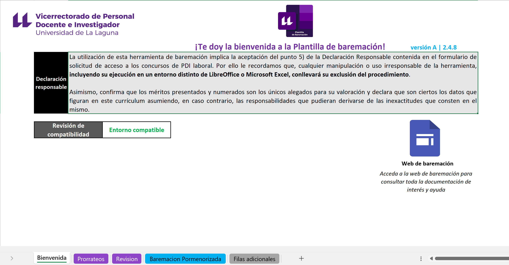

#### Hoja - Prorrateos

En esta hoja encontrará una serie de calculadoras que, en caso de necesidad, le ayudarán a la hora de prorratear ciertos valores durante su declaración de méritos.

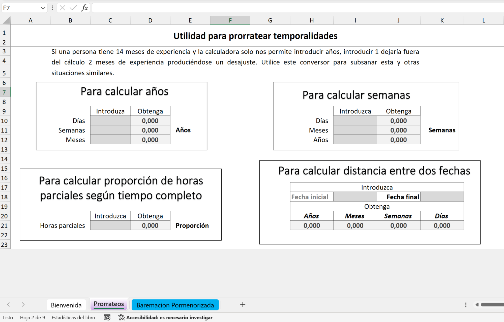

#### Hoja - Baremación Pormenorizada

En esta hoja realizará su baremación pormenorizada / declaración de méritos, con arrelgo a lo indicado en el Reglamento de Contratación de la ULL.

#### Hoja - Revisión

En esta hoja encontrará una serie de controles que le ayudarán a comprobar el estado de su declaración de méritos según datos de la hoja *Baremacion Pormenorizada*.

#### Hoja - Filas adicionales

En esta hoja podrá ampliar su declaración de méritos en el caso de que la extensión de la estructura de filas disponibles en la hoja *Baremacion Pormenorizada* no le resulte suficiente.

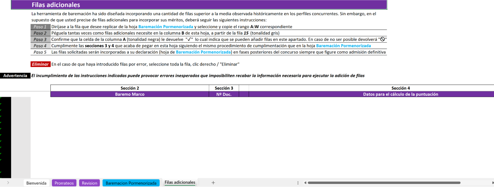

### Cómo introducir información - Estilos de celdas

En la herramienta se utilizan varios estilos de celda para diferenciar cuáles de estas celdas requieren la inserción de información por su parte, cuáles muestran información de manera automática o fija y cuáles están reservadas para la Comisión.

Para su distinción, se ha utilizado el siguiente estilo de colores:

* Celda gris clara 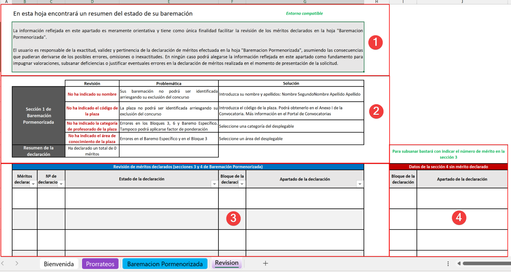 para las candidaturas.
* Celda gris oscura  para las Comisiones.
* El resto de formatos de celda no requieren interacción.

!!! info "Listas desplegables"
    En gran parte de las celdas con las que interactuar, encontrará listas desplegables con opciones cerradas. En dichos casos, deberá seleccionar una opción de las disponibles.
    

## Paso 1 de la baremación - Declaración de méritos en la hoja Baremación Pormenorizada

La hoja de *Baremación Pormenorizada* será donde transcurra la mayor parte del tiempo a la hora de trabajar con la herramienta. Por ello, es fundamental que entienda su estructura.

### Secciones de la hoja Baremación Pormenorizada

Esta se distribuye en varias secciones tal y como puede observar en la siguiente imagen:

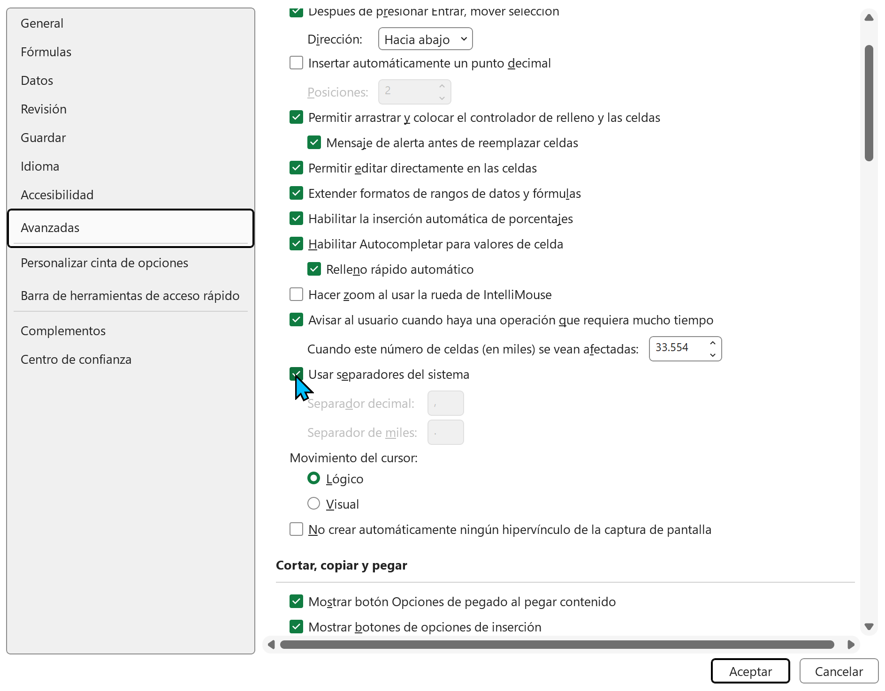

#### Sección 1 - Encabezados informativos

Aquí encontrará el logo institucional, la versión de la herramienta, los datos identificativos con las puntuaciones finales, la tabla del resumen de puntuación y un enlace con más información.

#### Sección 2 - Apartados del Reglamento

En esta sección, se representa la estructura de apartados según el Reglamento de Contratación así como las filas disponibles para declarar sus méritos.

#### Sección 3 - Número de documento

En esta sección indicará, **numéricamente**, qué documento justificativo de sus méritos está declarando.

!!! warning "Importante"
    Considere que este número debe coincidir con la numeración dada por usted a los documentos justificativos de sus méritos aportados en su expediente de solicitud de concurrencia.

#### Sección 4 - Datos para el cálculo de las puntuaciones

En esta sección, declarará las variables que han de ser tenidas en cuenta, según el Reglamento de Contratación, a la hora de puntuar sus méritos.

!!! warning "Importante"
    Siempre que usted declare méritos en la sección 3, deberá cumplimentar los campos de la sección 4, de lo contrario, la herramienta no dispondrá de datos para puntuar sus méritos y arrojará errores.

#### Sección 5 - Puntuaciones y valoración

Aquí se mostrarán las puntuaciones resultantes de su declaración en tres niveles así como la valoración estimada por la Comisión según el nivel de afinidad del mérito a la plaza.

* **Puntuación 1 (P.1)**: Puntuación en bruto del mérito después de aplicar los pasos para el cálculo establecidos en el Reglamento de Contratación.  
* **Valoración**: Declaración de la Comisión de Baremación sobre el nivel de afinidad del mérito y si procede o no su valoración.  
* **Puntuación 2 (P.2)**: Puntuación 1 \+ Aplicación del nivel de afinidad.  
* **Puntuación 3 (P.3)**: Puntuación 2 \+ Aplicación del factor de ponderación. **Sobre esta puntuación se basará la puntuación final o global.**

!!! info "Aclaración sobre las puntuaciones 2 y 3"
    Considere que, tanto los datos de valoración como las puntuaciones 2 y 3 no estarán disponibles en esta herramienta hasta fases finales ya que estos datos dependen de la interacción de la Comisión. Este hecho no se producirá hasta que inicie el proceso de baremación, después de la publicación del listado definitivo y siempre y cuando usted figure como admitido.

### Cumplimentación de la sección 1

Una vez entendido cómo interactuar con la herramienta y cuál es la estructura de la hoja de *Baremación Pormenorizada* deberá cumplimentar los datos de la sección 1 de esta hoja:

| | |
| --- | --- |
| **Candidatura** | *Su nombre y apellidos (Ej: Jesús María López)* |
| **Código de la plaza** | Encontrará los datos en el Anexo I de la convocatoria a la que vaya concurrir, que estará disponible en el Boletín Oficial correspondiente, el portal de convocatorias de la ULL y en el Tablón de Anuncios electrónico de la ULL |
| **Categoría de profesorado de la plaza** | *Seleccione una opción del desplegable* |
| **Área de la plaza** | *Seleccione una opción del desplegable* |

!!! info "Aclaración sobre el código de los concursos de bolsa de sustitución"
    En el caso de concursos de bolsa de sustitución no existe un código alfanumérico asociado al concurso por lo que, en el campo de “Código de la plaza” deberá indicar "**Bolsa de sustitución**".

## Paso 2 de la baremación - Declaración de méritos

Una vez cumplimentada la sección 1, deberá proceder a declarar sus méritos cumplimentando las **secciones 3** (Número de Documento \ Nº Doc.) y **4** (Datos para el cálculo de la puntuación).

### Paso 2.1 de la baremación - Cómo declarar los méritos

Tal y como se expuso en apartados anteriores, deberá interactuar con las celdas que tengan el formato de estilo adecuado según la leyenda de colores explicada previamente. Considerado lo anterior, para baremar deberá proceder, en general, de la siguiente manera:

1. Utilizar la sección 2 (**Apartados del Reglamento**) como una guía o índice a la hora de trabajar.  
2. Introducir el número de documento del mérito en la sección 3 (**Número de documento**).  
3. Introducir los datos del mérito de la sección 4 (**Datos para el cálculo de las puntuaciones**).

#### Ejemplo de declaración de un mérito

Veamos cómo proceder con un ejemplo paso a paso, utilizando el apartado 1 del Bloque 1º del Reglamento de Contratación (*Expediente, premios y pruebas o trabajos de fin de titulación*).

#### Paso 2.1.1: Identificar, en la sección 2, el apartado del mérito a declarar

Mirando la sección 2, buscaremos el apartado en el que debe declararse el mérito.

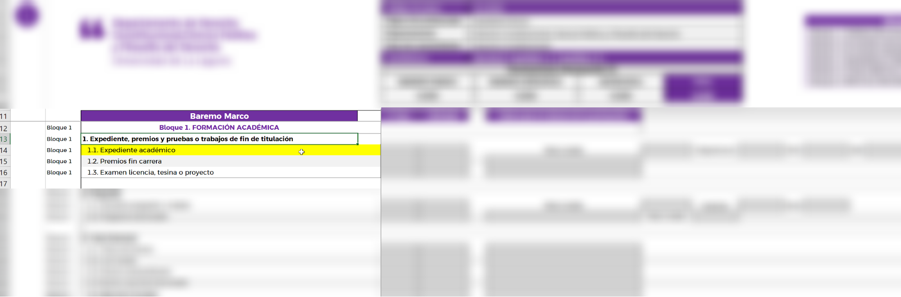

#### Paso 2.1.2: Añadir el número de documento según la relación de méritos

A continuación, procederemos a declarar, en la sección 3, el número de documento según la equivalencia correspondiente de la numeración dada por usted en la relación de méritos aportada en su solicitud:

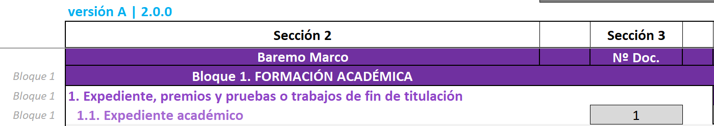

#### Paso 2.1.3: Introducir la información necesaria para el cálculo de la puntuación

Si el documento acreditativo del mérito cuenta con una nota media de la titulación en base 10, introduciremos este valor en la celda correspondiente de la sección 4. De lo contrario, deberemos utilizar el método de cálculo de puntuación alternativo (método cualitativo) y sus celdas correspondientes.

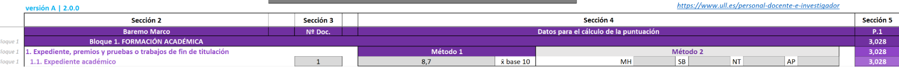

!!! info "Considere que este es el único apartado del Baremo Marco que contempla dos métodos de cálculo"

!!! info "Aclaración de errores"
    La herramienta incorpora un sistema de detección de errores en la declaración que le advierte en el caso de que introduzca datos de la sección 3 pero no de la sección 4 y viceversa. **Para más detalles consulte el FAQ**.

### Paso 2.2 de la baremación: Interpretación de las puntuaciones

A medida que vaya cumplimentando su declaración de méritos, la sección 5 de la baremación irá mostrando, de manera automatizada, las puntuaciones correspondientes. Con ello, la herramienta irá tomando el siguiente aspecto:

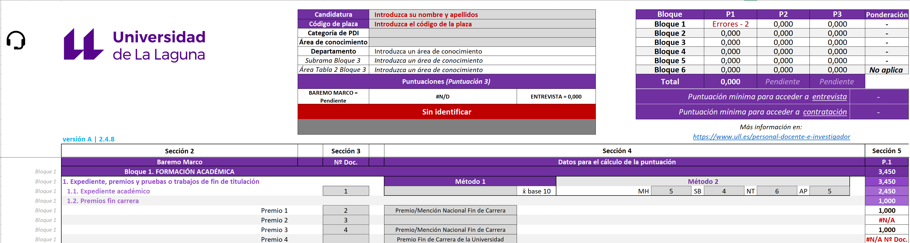

Observe que, en la sección 1, también se irán actualizando datos y, en caso de errores, también se advertirán.

??? question "¿Cómo se interpretan los errores de la imagen?"
    En la imagen se observan varias incidencias. Por un lado, los datos personales y de identificación no están cumplimentados por lo que tenemos textos en rojo a modo de advertencia que nos indican "Sin identificar". Además, en el cuadro resumen de la sección 1 se observa que para la P1 existen 2 errores. Para identificarlos hay que revisar el bloque correspondiente en el que se indica su existencia.
    En este caso, tenemos dos errores, '#N/A' y '#N/A Nº Doc'. Ambos son advertidos en la sección 5 en sus filas correspondientes. Para más información sobre estos, consulte el FAQ.

Tal y como se comentó en apartados previos, existen 3 tipos de puntuación:

#### Puntuación 1 - P.1: Puntuación en bruto del mérito

En esta puntuación se realizan los cálculos de puntuación básicos del Reglamento de Contratación sin aplicar niveles de afinidad ni factor de ponderación por tipo de plaza. Sólo se aplican los límites máximos de puntuación establecidos.

!!! info "Aclaración sobre la P1"
    Esta es la puntuación que verá inicialmente pero esta **no es la puntuación definitiva y no debe ser tomada como tal**. **Ver el FAQ para más información**.

#### Puntuación 2 - P.2: Puntuación aplicando afinidad (no visible inicialmente)

En esta puntuación se aplica, a cada uno de sus méritos, el nivel de afinidad de estos con respecto a la plaza según el criterio de la Comisión.

#### Puntuación 3 - P.3: Puntuación aplicando afinidad y ponderación (Puntuación final  no visible inicialmente)

Por último, la **P.3 es la puntuación que define el orden de prelación de la plaza ya que aplica tanto nivel de afinidad como factor de ponderación**. Será la que se muestre en la parte de datos identificativos de la sección 1 así como en la documentación final de la baremación emitida por la Comisión: el resumen de la plaza, acta de comisión, baremaciones pormenorizadas y propuesta de contratación de la plaza.

!!! info "Aclaración sobre las puntuaciones 2 y 3"
     Estas puntuaciones no serán visible en la fase de concurrencia, pasando a estar disponibles en la fase de baremación después del listado definitivo.

## Paso 3 de la Baremación: Baremo Específico

En este Bloque podrá incorporar los méritos que considera que han de ser valorados, indicando únicamente el número de documento y reservando la valoración de estos a la Comisión de Baremación. Para ello, bastará con introducir los números de documentos separados por comas  “,” en la parte reservada para las candidaturas según los estilos de celda que vimos previamente.

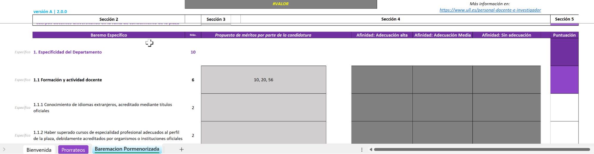

!!! info "Aclaración sobre el Baremo Específico"
    Este apartado puede ser cumplimentado por usted siempre que lo estime oportuno pero, en última instancia, será la Comisión la que decida qué méritos pueden ser contenidos aquí. *Ver el FAQ para más información*.

## Paso 4 de la baremación: Observaciones

Al final del Bloque de Baremo Específico encontrará un campo de observaciones generales que le permitirá introducir observaciones generales acerca de la baremación.  
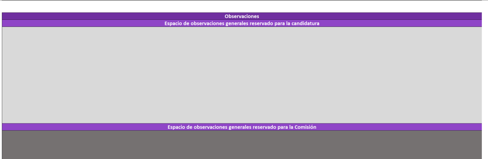

Utilice la celda que está reservada para las candidaturas en el caso de querer incorporar cualquier observación general. Por otro lado, si desea incorporar comentarios más específicos deberá hacer uso de la opción “Introducir comentarios” de Excel siguiendo las [instrucciones de Microsoft](https://support.microsoft.com/es-es/office/insertar-comentarios-y-notas-en-excel-bdcc9f5d-38e2-45b4-9a92-0b2b5c7bf6f8#:~:text=fines%20de%20anotaci%C3%B3n-,Haga%20clic%20derecho%20en%20la%20celda%20y%2C%20a%20continuaci%C3%B3n%2C%20haga,clic%20fuera%20de%20la%20celda.). Con esto, la autobaremación / declaración de méritos ya estaría finalizada.

!!! warning "Aclaración de compatibilidad sobre las Observaciones Específicas"
    La funcionalidad para incorporar observaciones específicas puede resultar incompatible con LibreOffice o versiones antiguas de Excel.

## Paso 5 de la baremación: Filas adicionales

En el supuesto de que, en un apartado de la herramienta, se encuentre con menos filas disponibles que méritos desea declarar deberá dirigirse a la hoja **Filas adicionales** y seguir las siguientes instrucciones:

Imaginemos la siguiente declaración de méritos para los apartados 1.1 (Expediente Académico) y 1.2 (Premios fin de carrera) del Bloque 1:

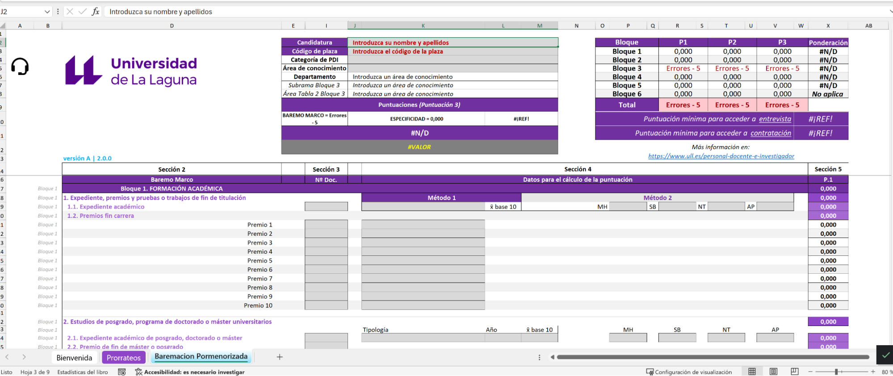

Si deseara añadir filas adicionales para cualquiera de estos apartados deberá seguir los siguientes pasos:

### Paso 1 - Filas adicionales

Diríjase a la fila que desee replicar de la hoja Baremación Pormenorizada y seleccione y copie el rango A:W correspondiente.

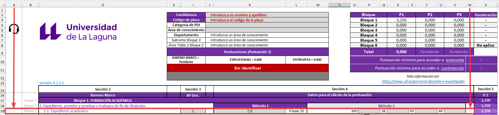

### Paso 2 - Filas adicionales

Péguela tantas veces como filas adicionales necesite en la columna B de esta hoja, a partir de la fila 15 (tonalidad gris).

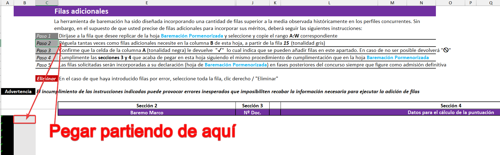

### Paso 3 - Filas adicionales

Confirme que la celda de la columna A (tonalidad negra) le devuelve "✓", lo cual indica que se pueden añadir filas en este apartado. En caso de no ser posible, devolverá "🛇".

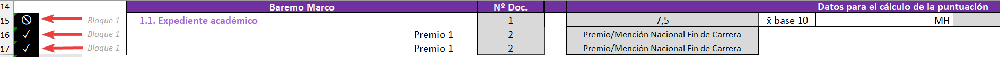

Observe como, en este ejemplo, el apartado 1.1 no permite la adición de filas mientras que el apartado 2 sí lo permite.

### Paso 4 - Filas adicionales

Cumplimente las secciones 3 y 4 que acaba de pegar en esta hoja siguiendo el mismo procedimiento de cumplimentación que en la hoja Baremación Pormenorizada.

Nota: Al pegar, considere que los datos de las secciones 3 y 4 serán los de origen. Por tanto, deberá sustituir la información de las secciones 3 y 4 por aquellos reales tras realizar la acción de pegar.

### Paso 5 - Filas adicionales

Las filas solicitadas serán incorporadas a su declaración (hoja de Baremación Pormenorizada) en fases posteriores del concurso siempre que figure como admisión definitiva.

Esta solicitud de filas, en el caso de que usted figure como admisión definitiva y, por tanto, deba ser baremado, serán incorporadas por parte del Soporte Técnico a su declaración de méritos.

## Paso 6 de la baremación: Revisión

!!! warning "Dependiendo de su versión de Office, es posible que las funcionalidades contenidas en esta hoja no sean compatibles"

Tras haber cumplimentado su declaración de méritos / autobaremación, se recomienda, antes de aportar el archivo en el procedimiento de Sede Electrónica habilitado a tal efecto, revisar la información contenida en la hoja **Revisión** para subsanar cualquier error existente.

### Secciones de la hoja Revisión

En esta hoja encontrará 4 secciones:

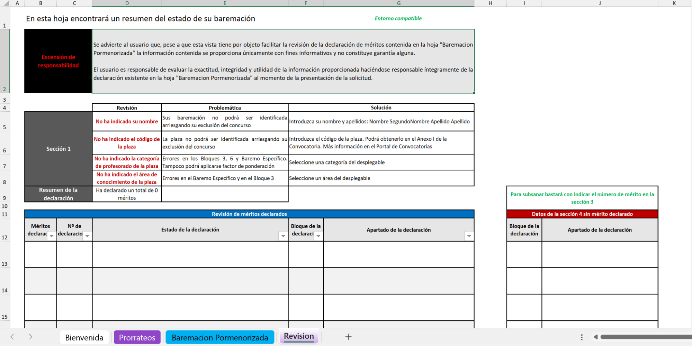

#### Sección 1 - Advertencia inicial

En esta sección encontrará una advertencia de limitaciones de la hoja así como un control de compatibilidad de la misma.

#### Sección 2 - Revisión de la sección 1 de la hoja Baremación Pormenorizada

Comprobación de la existencia de errores en la sección 1 de la hoja **Baremación Pormenorizada** con textos explicativos de sus consecuencias y métodos de subsanación.

También encontrará un cómputo general del número de méritos declarados y los errores totales existentes en la baremación.

#### Sección 3 - Revisión detallada de los méritos declarados en la hoja Baremación Pormenorizada

Encontrará un listado detallado de todos los méritos declarados, el número de veces que se repite la declaración de dicho mérito, si existe algún error así como el Bloque y Apartado de la declaración.

#### Sección 4 - Revisión de posibles errores de omisión de identificación de mérito

Encontrará un listado detallado de todos aquellos apartados en los que se han indicado datos de la sección 4 de la hoja de Baremación Pormenorizada pero no se ha declarado un número de documento en la sección 3 de dicha hoja.

## Paso 7 de la baremación: Sede Electrónica

Tras la realización de estos pasos, su Plantilla de Baremación ya estará disponible para ser aportada en el procedimiento de concurrencia de la Sede Electrónica.

## Control de calidad y soporte

Si experimenta algún tipo de incidencia técnica relacionada con la ejecución o uso de la herramienta de Plantilla de Baremación, por favor, revise el [repositorio de Baremación de Plazas de PDI Laboral del Centro de Ayuda](https://sites.google.com/ull.edu.es/soporte-vicpdi/repositorios/baremacion-pdil), en él encontrará todos los canales de comunicación.

## Flujo del proceso

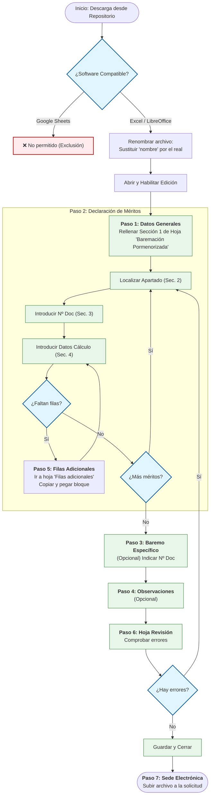