# Instrucciones para el trabajo colaborativo

Este documento describe el procedimiento recomendado para compartir y colaborar en la Plantilla de Integración entre los miembros de la Comisión.

---

## Requisitos previos

### Paso 1: Instalación o actualización de Office 365

Para habilitar las funciones de trabajo en grupo, es requisito utilizar la versión Office 365.

| Acción | Descripción | Imagen |
| :--- | :--- | :---: |
| **Acuerdo Institucional** | La Universidad de La Laguna cuenta con un acuerdo que facilita Office 365 ProPlus al personal educativo y administrativo. | 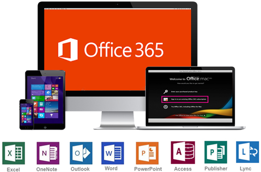{ width="25%" } |
| **Registro** | El usuario debe realizar el registro siguiendo las instrucciones específicas de la ULL (ver más información). | 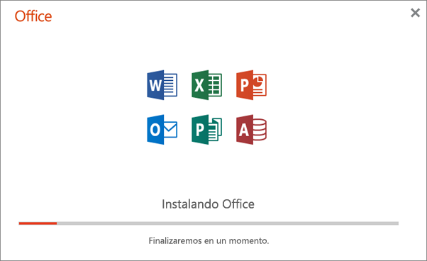{ width="25%" } |
| **Instalación** | Puede seguir las instrucciones de Microsoft para realizar la instalación. | 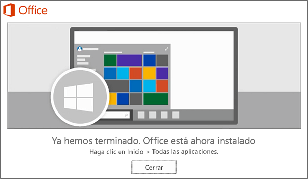{ width="25%" } |

---

## Configuración del entorno de trabajo

### Paso 2: Apertura del archivo

| Acción | Descripción | Imagen |
| :--- | :--- | :---: |
| **Apertura** | Una vez verificada la versión de Office, abra el archivo de trabajo que desea compartir. | 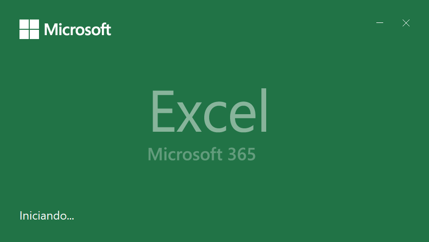{ width="25%" } |

### Paso 3: Compartir y colaborar

Siga estos pasos técnicos dentro de la aplicación Excel:

| Acción | Descripción | Imagen |
| :--- | :--- | :---: |
| **1. Opción "Compartir"** | Haga clic en la opción "Compartir" en la esquina superior derecha de la ventana. | { width="25%" } |
| **2. Carga en la Nube** | Seleccione la cuenta institucional "OneDrive - ull.edu.es" y espere a que el archivo se cargue. | 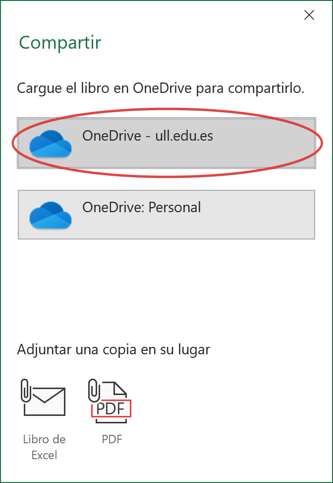{ width="25%" }    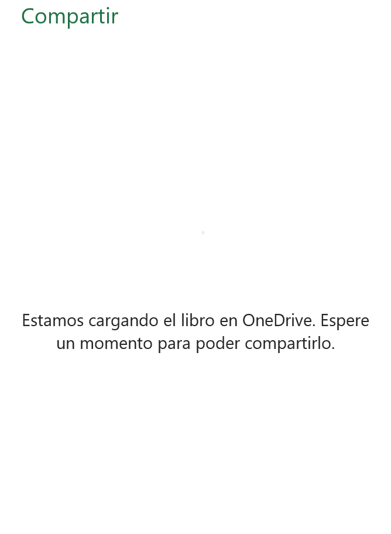{ width="25%" } |
| **3. Configuración de Vínculos** | <ul><li>Acceda a "Configuración de vínculos".</li><li>Seleccione la opción "Personas determinadas".</li><li>En "Otras configuraciones", active la casilla "Permitir la edición".</li><li>Pulse en "Aplicar".</li></ul> | 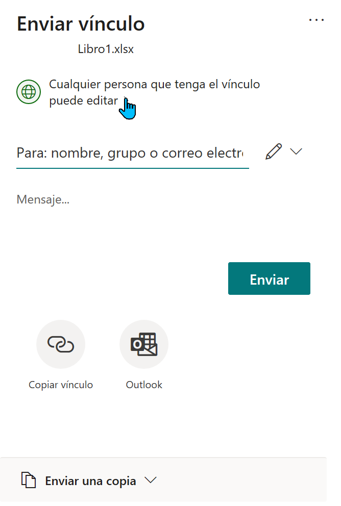{ width="25%" }    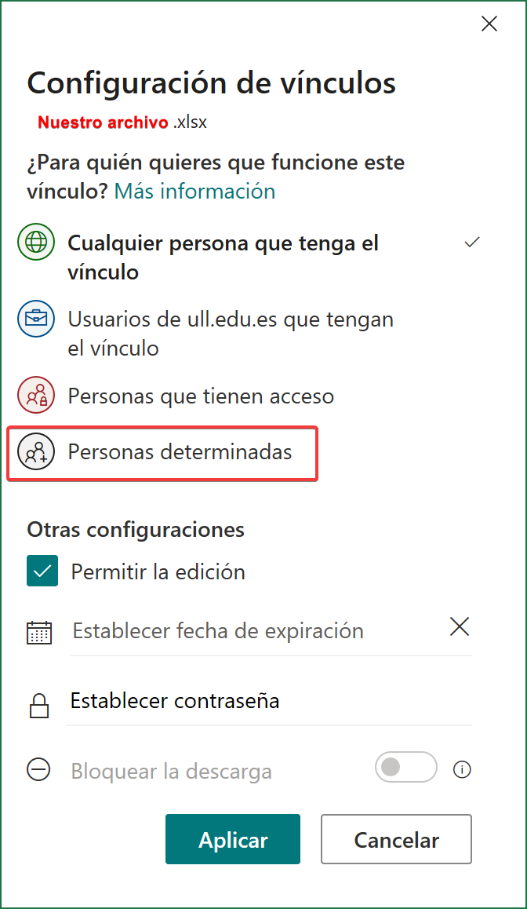{ width="25%" } |
| **4. Envío** | Introduzca los correos electrónicos de las personas autorizadas para generar el envío del vínculo. | 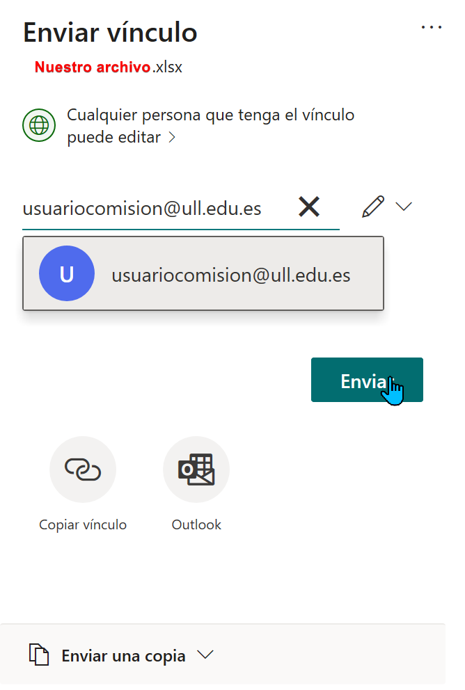{ width="25%" } |

---

## Interacción de los usuarios autorizados

| Acción | Descripción | Imagen |
| :--- | :--- | :---: |
| **Notificación** | Los colaboradores recibirán un correo electrónico para abrir el archivo directamente. | 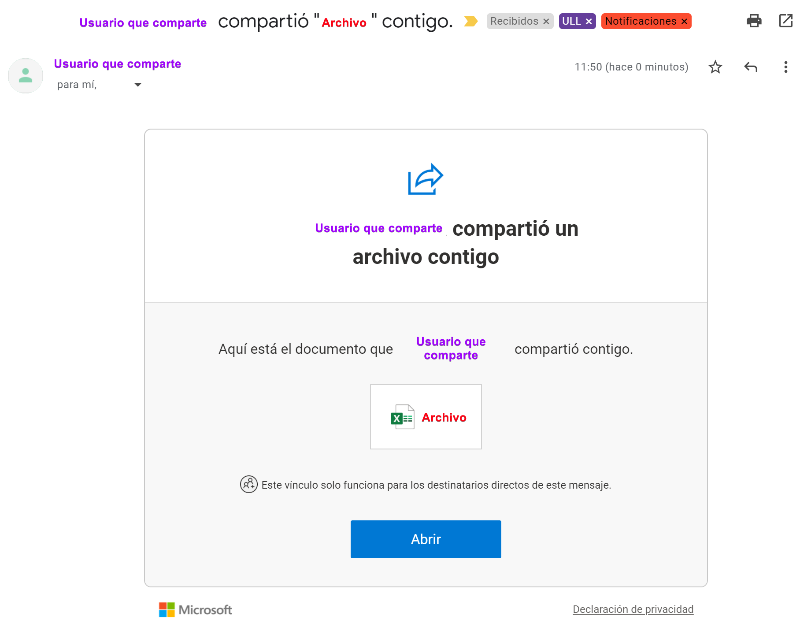{ width="25%" } |
| **Identidad** | El sistema solicitará un código de verificación para confirmar la identidad antes de permitir el acceso. | 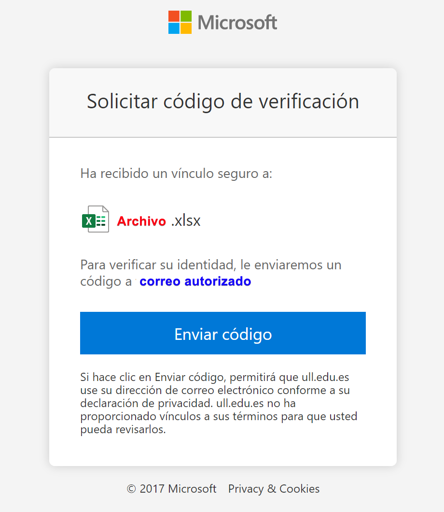{ width="25%" } |
| **Modo Colaborativo** | Una vez dentro, el propietario y los usuarios autorizados podrán trabajar de forma simultánea. El programa indicará quién se ha unido y quién tiene abierto el libro en ese momento. | 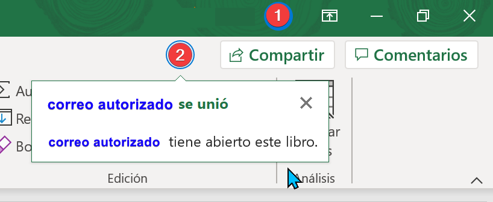{ width="25%" } |
| **Autoguardado** | Verifique que el interruptor de AutoGuardado (arriba a la izquierda) esté Activado. Esto garantiza que los cambios de todos los usuarios se fusionen al instante. | 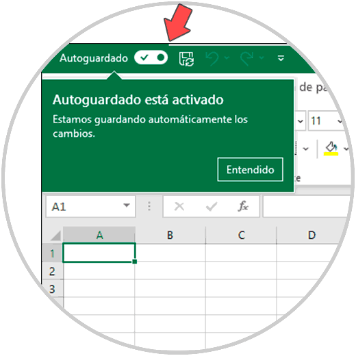{ width="25%" } |

---

## Consideraciones de seguridad

!!! danger "Restricción crítica"
    Este procedimiento **no debe utilizarse** bajo ninguna circunstancia para compartir el archivo con candidaturas.

* **Alojamiento**: El archivo compartido reside en el servidor de OneDrive empresarial de su cuenta Office.

* **Soporte**: En caso de dudas técnicas, puede consultar el [hilo de soporte oficial de Microsoft](https://support.microsoft.com/es-es/office/colaborar-en-libros-de-excel-al-mismo-tiempo-con-la-co-autor%C3%ADa-7152aa8b-b791-414c-a3bb-3024e46fb104).

---
