# Plantilla de Integración - Manual de uso

## Introducción

La Plantilla de Baremación es una herramienta digital, diseñada en formato de hoja de cálculo, que aplica con precisión lo establecido en el Reglamento de Contratación de Personal Docente e Investigador Laboral de la Universidad de La Laguna siguiendo los criterios de fiabilidad, replicabilidad y seguridad correspondientes.

La misma permite realizar la declaración de méritos y obtener, de manera automatizada, las puntuaciones correspondientes la declaración de méritos efectuada.

Además, la utilización de este formato permite establecer un sistema estandarizado de baremación optimiza el proceso para todos los agentes implicados mejorando la transparencia del proceso.

A lo largo de este manual se irá desarrollando una guía, que contiene, paso a paso, todas las instrucciones necesarias para conocer y utilizar correctamente la herramienta. Para ello, se apoyará el texto con la incorporación de imágenes que faciliten la comprensión de las explicaciones.

Con la modificación del formato de currículum detallado realizada en los concursos de plazas de PDI laboral se optimizó el proceso de baremación. En este sentido se produjeron los siguientes cambios:

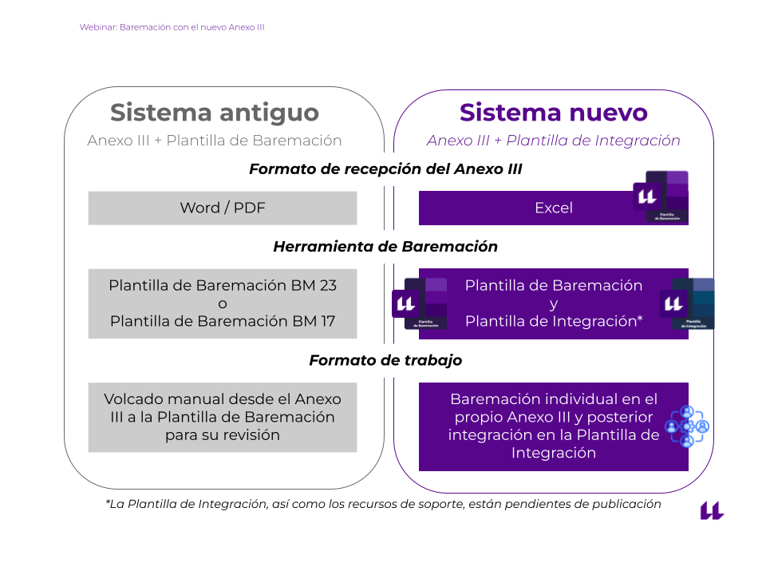{ width="50%" }

De esta manera, la Comisión ha pasado de emplear un único archivo en formato hoja de cálculo, a dos archivos:

{align=left width="5%" }
**Plantilla de Baremación - Candidaturas**.

---

{align=left width="5%" }
**Plantilla de Integración - Comisiones**.

## Requisitos técnicos y acceso a la herramienta

### Compatibilidad y software necesario

Para garantizar el correcto funcionamiento de las herramientas es imprescindible utilizar una de las siguientes suites ofimáticas:

* **Microsoft Excel**
* **LibreOffice Calc**

!!! info "Aclaración de compatiblidad"
    Considere que la antigüedad del software de ofimática puede provocar la imposibilidad de acceder a algunas de las funcionalidades más avanzadas de la herramienta así como provocar errores. No obstante, esto no supone un motivo de exclusión del concurso ya que dichos errores serán subsanados en fases posteriores del concurso, siempre que usted resulte admitido definitivo.

    !!! success "Utilice Office 365 para garantizar el 100% de compatibilidad."

!!! warning "Recuerde que la utilización de la suite ofimática de Google Workspace más conocida como Google Drive / Google Sheets no está permitida al ir contra las políticas de garantía."

### Descarga y versiones

Para descargar la herramienta, siga las instrucciones indicadas en el [repositorio de Baremación de Plazas de PDI Laboral del Centro de Ayuda](https://sites.google.com/ull.edu.es/soporte-vicpdi/repositorios/baremacion-pdil).

Asimismo, en este repositorio también encontrará el acceso al [log de desarrollo](https://sites.google.com/ull.edu.es/soporte-vicpdi/repositorios/logs) que contiene todos los cambios introducidos en las versiones de la herramienta.

#### Identificación de versiones

Tanto en el nombre del archivo en el momento de su descarga, como en las hojas de bienvenida y baremación pormenorizada, se identificará la versión de la herramienta. Se utilizarán los siguientes formatos:

##### En el nombre del archivo

!!! quote "BM X | #.#.#"
    Ejemplo: BM 24 | 1.0.8

Donde BM alude "Baremo Marco", 'X' al año del Reglamento y las almohadillas a la versión numérica de la herramienta en formato Semantic Versioning (SemVer).

##### En el interior de la herramienta

Asimismo, como la herramienta de Integración en fases finales integrará ambas herramientas. Estas se identificarán de la siguiente forma:

Versión “I” (de Integración) para la versión de la herramienta de Integración y “A” (de Autobaremación) para la versión de la herramienta de Baremación.

Este aspecto es importante para que pueda corroborar que en todo momento está haciendo uso de la última versión disponible o de una versión aceptada en el concurso.

No obstante, en caso de duda, siempre puede ponerse en contacto con [el Soporte Técnico](https://sites.google.com/ull.edu.es/soporte-vicpdi/contacto).

## Preparación y estructura de las herramientas

### Primera apertura de las herramientas de baremación

!!! info "En LibreOffice este paso no es preciso"

Debido a la política de seguridad de Microsoft,  con la primera apertura veremos el siguiente mensaje:

Haremos clic en “Habilitar edición” para poder editar el archivo.

Asimismo, deberemos aceptar un nuevo banner para habilitar las macros que permiten ejecutar código en el archivo de Plantilla de Integración:

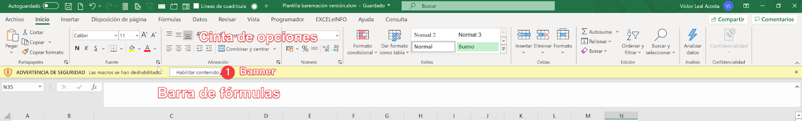

En ocasiones, es posible que el proceso para habilitar las macros requiera un paso adicional, en cuyo caso deberemos:

A. **Seguir las** [**instrucciones del Soporte de Microsoft**](https://support.microsoft.com/es-es/office/habilitar-o-deshabilitar-macros-en-archivos-de-microsoft-365-12b036fd-d140-4e74-b45e-16fed1a7e5c6).

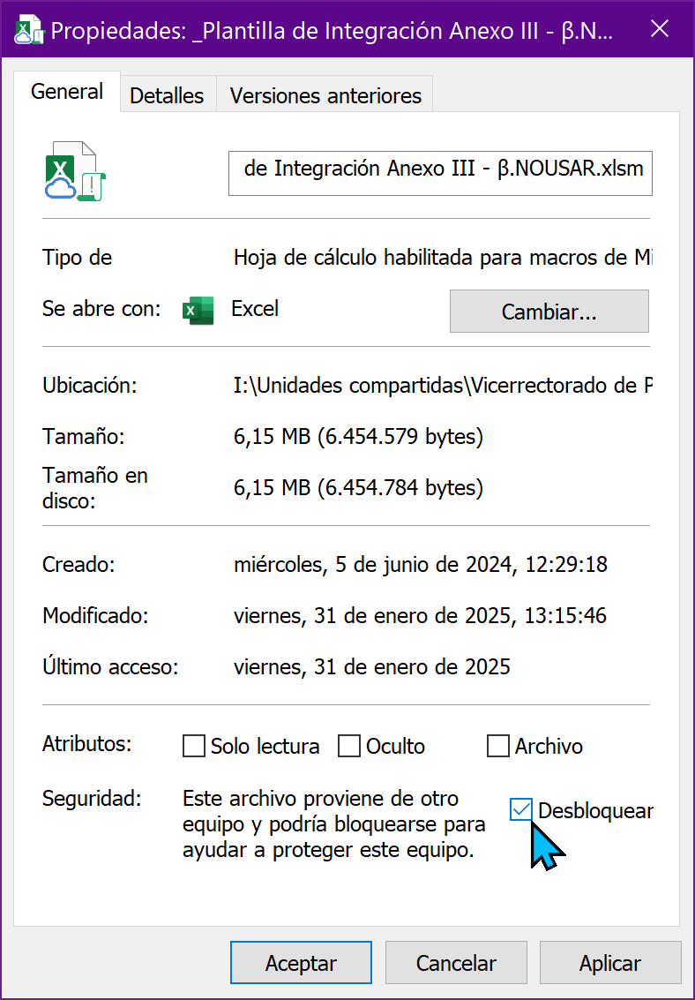{ align=right width="15%" }
B. **Cambiar las propiedades del archivo en Windows**:

* Identificamos el archivo en nuestro explorador de archivos.  
* Clic derecho / Propiedades  
* Desbloqueamos el archivo y aceptamos como vemos en la imagen.

### Estructura de contenido

Dado que trabajamos con dos herramientas, en primer lugar es recomendable que conozca la estructura de la Plantilla de Baremación, para ello, consulte [el apartado 'Secciones de la hoja de Baremación Pormenorizada' del Manual de uso de la Plantilla de Baremación](../candidaturas/manual_plantilla.md#secciones-de-la-hoja-baremacion-pormenorizada). **De este archivo, solo guarda relevancia para la Comisión la hoja denominada “Baremación Pormenorizada”**.

Por otro lado, la Plantilla de Integración tiene la siguiente estructura de hojas:

1. Bienvenida
2. Resumen
3. Acta
4. Suplentes
5. Prorrateos

## Descripción detallada del contenido

### Plantilla de Integración - Bienvenida

En esta hoja se le dará la bienvenida a la herramienta donde podrá identificar la versión de la misma así como también dispondrá de un acceso a la web con el resto de documentación de interés.

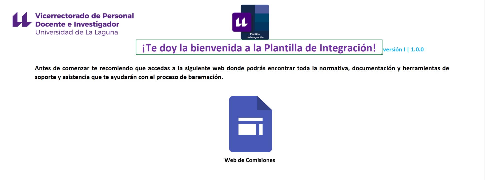

### Plantilla de Integración - Resumen

En esta hoja, conformada por tres páginas o secciones, encontrará:

| Página | Descripción e Imagen |
| :--- | :--- |
| **1 - Datos de la plaza y control de baremación** | *Configuración de la plaza así como control de potenciales errores existentes en la baremación.*    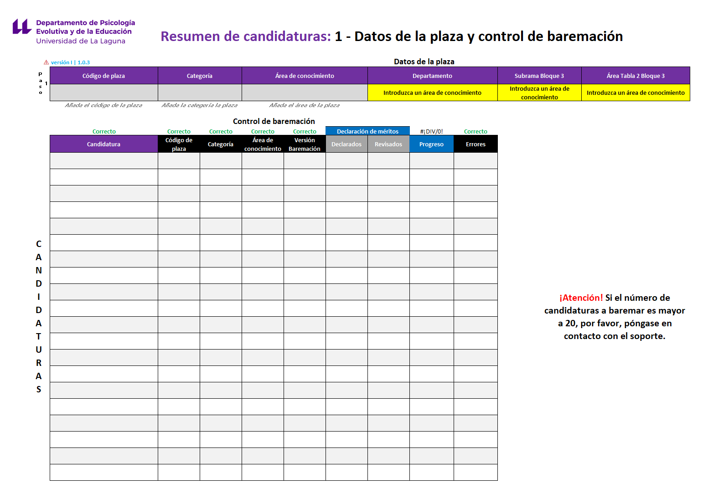{ width="300" } |
| **2 - Puntuaciones finales y orden de prelación** | *Orden de prelación de la plaza con el resultado de las puntuaciones finales por cada candidatura y bloque.*    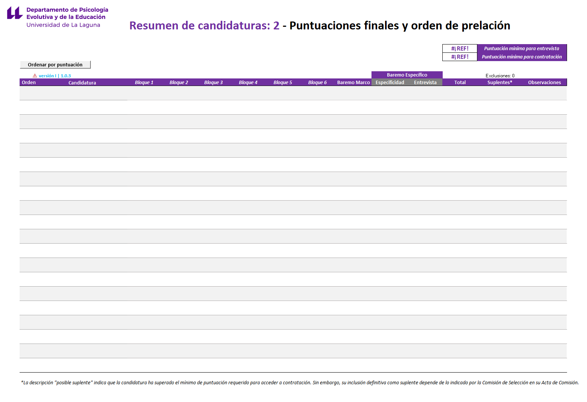{ width="300" } |
| **3 - Normalización de puntuaciones** | *Desglose del impacto de la normalización en las puntuaciones finales de las candidaturas.*    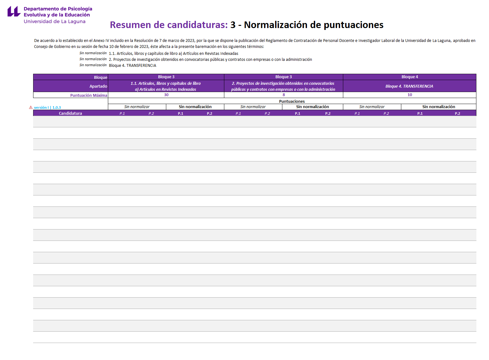{ width="300" } |

### Plantilla de Integración - Acta

Esta hoja contiene la estructura del informe de Acta de Comisión con la candidatura propuesta para contratación así como el listado de suplentes.

### Plantilla de Integración - Suplentes

Esta hoja contiene un resumen de aquellas candidaturas que pueden formar parte de la lista de suplentes de la plaza.

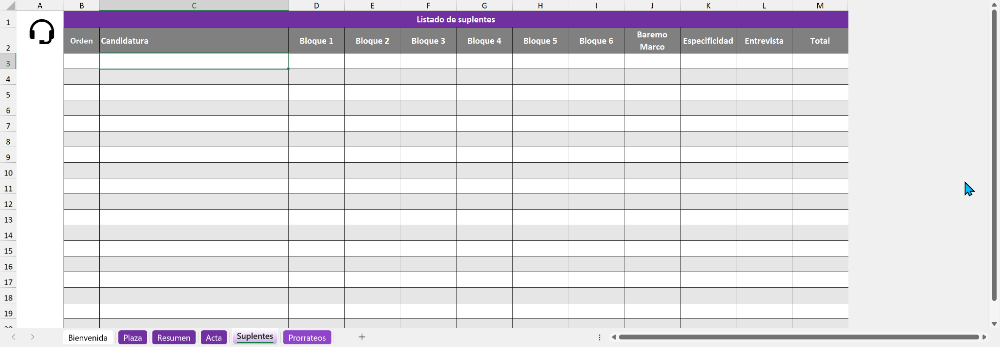

### Plantilla de Integración - Prorrateos

Esta hoja contiene una serie de calculadoras que le ayudarán a la hora de realizar distintos prorrateos necesarios en la baremación.

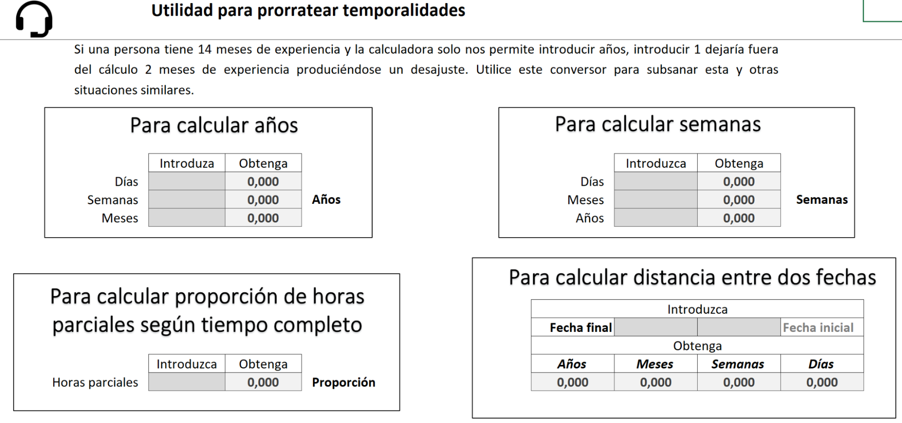

## **Cómo introducir información**

Antes de comenzar a explicar paso a paso cómo realizar la baremación, es importante que sepa cómo introducir información e interactuar con la herramienta. Como consideración principal, la herramienta deberá de utilizarse según el sistema de escritura alfabético, de izquierda a derecha y de arriba a abajo.

En la herramienta se utilizan varios formatos de celda para diferenciar cuáles de estas requieren la inserción de información por parte de la candidatura, cuáles quedarán reservadas para la Comisión y cuáles muestran información de manera automática. Para distinguir esta información, se ha utilizado la siguiente leyenda de colores:

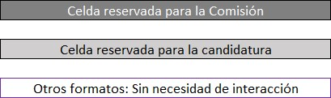

## Paso 1 - Recopilación y configuración de la plaza

### Recepción de la documentación (expedientes)

Una vez publicado el listado definitivo de la plaza, el Negociado de Personal Docente e Investigador laboral remitirá, vía comunicación electrónica, un enlace a la plataforma correspondiente para acceder a los expedientes de las candidaturas admitidas de manera definitiva.

Los expedientes contienen la documentación aportada por las candidaturas en su solicitud. Principalmente habrá dos formatos de archivo (.pdf y .xls) y tres tipologías:

* La Plantilla de Baremación (autobaremación / declaración de méritos) en formato .xls.
* Los justificantes acreditativos de los méritos alegados en la declaración (numerados y, por norma general, en formato .pdf).
* Otra documentación requerida para validar la concurrencia (DNI, abono de tasas...).

Una vez tenga el acceso a la documentación, siga los siguientes pasos:

1. Abra los expedientes e identifique las Plantillas de Baremación de cada una de las candidaturas (archivos .xls).  
2. Copie cada uno de estos archivos y péguelos en una nueva carpeta de su elección. Procure que esta carpeta solo almacene estos archivos para evitar errores posteriores en la ejecución del código.  
3. Una vez hecho esto, abra la Plantilla de Integración, configúrela según lo visto [en el apartado primera apertura de las herramientas de baremación](../comisiones/manual_integracion.md#primera-apertura-de-las-herramientas-de-baremacion), diríjase a la hoja **Resumen** y cumplimente los datos de la plaza (paso 1 de la herramienta):

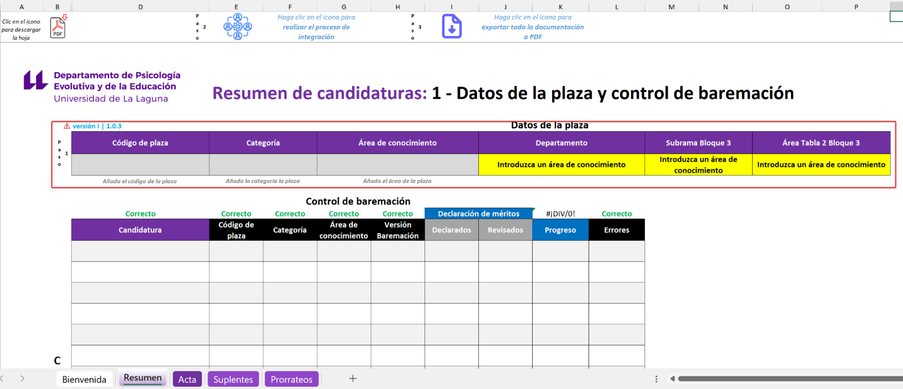

## Paso 2 - Proceso de integración y extracción de datos de candidaturas

1. Tras ello, haga clic en el icono del paso 2 de la herramienta { width=5% }.

2. Siga las instrucciones del proceso de integración seleccionando la carpeta en la que añadió los archivos de Plantillas de Baremación de las candidaturas. Podrá escoger la totalidad de archivos o hacer uso de la selección múltiple.

3. Una vez finalizado, verá como la tabla con los datos de la candidaturas se cumplimenta automáticamente.

!!! info "Aclaraciones sobre el proceso de integración"
    1. Lea con atención los mensajes de las ventanas emergentes, estos le guiarán durante el proceso.
    2. Sea paciente, el proceso será más o menos rápido dependiendo del número de candidaturas a integrar y de la capacidad de procesamiento de su entorno de ejecución.
    3. Dependiendo de algunos aspectos relacionados a las declaraciones de las candidaturas, es posible que, en última instancia, se prepare un correo automático para el Soporte. Siga las instrucciones contenidas en el mismo.
    4. En caso de dudas o dificultades póngase en contacto con [el Soporte Técnico](https://sites.google.com/ull.edu.es/soporte-vicpdi/contacto).

## Paso 3 - Revisión y corrección de datos identificativos de las candidaturas

Tras la obtención de los datos de las baremaciones pormenorizadas de las candidaturas deberá comprobar que no existen errores. Para ello, en el encabezado de la tabla encontrará los siguientes estados:

* **Correcto:** Los datos coinciden con la configuración de la plaza.  
* **N errores:** Existen datos omitidos por las candidaturas o que no coinciden con la configuración de la plaza. En este sentido encontrará dos situaciones:
* **Corregir:** Dato que no coincide. En ocasiones, las candidaturas cumplimentan una sola Plantilla de Baremación que reutilizan para concurrir a varias plazas. Deberá comprobar si, en efecto, la candidatura pertenece a la plaza objeto de baremación y subsanar la información con los datos correctos o, por el contrario, eliminar a la candidatura de la baremación.
* **No declarado:** Dato omitido. Deberá subsanarlo cumplimentando la información [siguiendo las indicaciones del apartado 'Cumplimentación de la sección 1' del Manual de uso de la Plantilla de Baremación.](../candidaturas/manual_plantilla.md/#cumplimentacion-de-la-seccion-1)

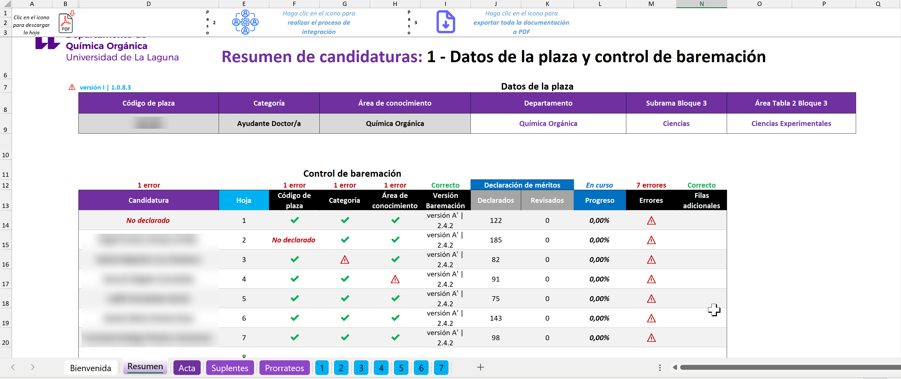

??? question "Preguntas frecuentes"
    ¿Cómo elimino una candidatura de la Plantilla de Integración?
    ¿Qué significan los errores de la tabla de la hoja 1 (Datos de la plaza y control de la baremación)?
    Haga clic derecho en la hoja de la baremación pormenorizada cuyo número corresponda a la candidatura que desee eliminar y haga clic en eliminar.

    !!! warning "¡Cuidado! Esta acción no puede deshacerse por lo que preste especial atención para evitar pérdidas de datos indeseadas."

En este sentido, podemos encontrarnos con dos tipos de errores en los campos :

| *Error* | Descripción | Subsanación |
| :---: | :--- | :--- |
|  | La candidatura no cumplimentó el campo requerido de la sección 1 de la hoja baremación pormenorizada. | Diríjase a la sección 1 de la hoja afectada e introduzca los datos pertinentes. |
|  | Advertencia según los datos de la plaza: posible inconsistencia en los campos. | Esto puede indicar varias situaciones dependiendo de dónde aparezca la advertencia. Para más detalles, vea la aclaración al pie. |

!!! warning "Es fundamental subsanar estos errores, de lo contrario, como veremos más adelante, la documentación de la baremación no será aceptada."

??? info "Aclaración sobre posibles inconsistencias"
    1. Si la advertencia aparece en los campos 'Candidatura', 'Código de plaza', 'Categoría' y/o 'Área de conocimiento' indica una posible inconsistencia con los datos de la plaza por lo que pudiera ser que la candidatura no pertenezca al concurso.
    2. Si aparece en el campo 'Errores' indica que hay errores en las puntuaciones de la baremación pormenorizada, esto es normal en tanto que resten méritos por revisar.
    3. Si aparece en el campo 'Filas adicionales' indica que la candidatura solicitó filas adicionales y dicha solicitud ha de ser atendida por el soporte.

Además de lo anterior, verá varios campos de la tabla que le informarán del progreso de la baremación. Le serán de utilidad a efectos de revisión:

* **Declarados**: Indica los méritos declarados por la candidatura en su baremación pormenorizada.

* **Revisados**: Indica, de los méritos declarados, cuantos han sido revisados al contar con datos de valoración.

* **Progreso**: Indica el porcentaje de méritos que han sido revisados respecto de los declarados. Además, se incorpora un encabezado de “***En curso***” si faltan méritos por revisar o “**Completada**” si ya estuviesen todos los méritos revisados.

## **Paso 4 - Baremación y revisión de méritos**

Tras configurar correctamente:

* [El archivo](../comisiones/manual_integracion.md/#primera-apertura-de-las-herramientas-de-baremacion),  
* [La plaza](../comisiones/manual_integracion.md/#paso-1-recopilacion-y-configuracion-de-la-plaza) y  
* [Los datos de las candidaturas](../comisiones/manual_integracion.md/#paso-3-revision-y-correccion-de-datos-identificativos-de-las-candidaturas).

Deberemos ir a las hojas de baremación pormenorizada de cada candidatura para proceder a la revisión y baremación de méritos.

Para ello, deberá entender primero la estructura de esta hoja siguiendo la siguiente explicación.

## Hoja de baremación pormenorizada

Como se ha ido mencionando, esta hoja es aquella en la que deberá realizar la revisión de los méritos. La misma tiene dos estados:

* **Pre-Integración**: Es el estado en el que se encuentra dentro de la herramienta Plantilla de Baremación.
* **Post-Integración**: Es el estado en el que se encuentra tras realizar el proceso de integración con la herramienta de Plantilla de Integración.

### Hoja de baremación pormenorizada (Pre-Integración)

La estructura de esta hoja se explica en [este apartado del manual de uso de la herramienta de Plantilla de Baremación](../candidaturas/manual_plantilla.md#secciones-de-la-hoja-baremacion-pormenorizada). **Le recomendamos su revisión** para entender la estructura de la información.

### Hoja de baremación pormenorizada (Post-Integración)

Tras el proceso de integración, además de las secciones descritas en el [apartado del manual de uso de la herramienta de Plantilla de Baremación](../candidaturas/manual_plantilla.md#secciones-de-la-hoja-baremacion-pormenorizada), se mostrarán las secciones 6 (5.2) y 7 (5.3):

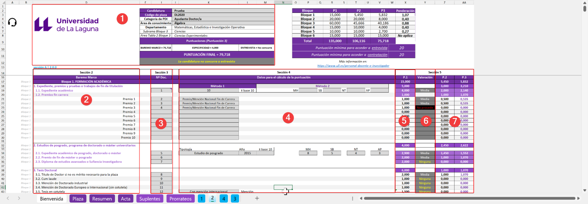

#### Sección 6 (5.2) - Valoración

En esta sección se aplicarán los niveles de afinidad del mérito así como también se indicará la posibilidad de no valoración del mismo “No procede”.

#### Sección 7 (5.3) - Puntuaciones 2 y 3 (P.2 y P.3)

* **Puntuación 2 (P.2)**: Puntuación 1 + Aplicación del nivel de afinidad.  
* **Puntuación 3 (P.3)**: Puntuación 2 + Aplicación del factor de ponderación. **Sobre esta puntuación se basará la puntuación final o global.**

## Datos declarados y revisión de méritos

Tal y como se explicó en el apartado ['Cómo introducir información'](/comisiones/manual_integracion.md/#como-introducir-informacion), el proceso de baremación requiere de la interacción de dos agentes. Por un lado, la candidatura y, por otro lado, la Comisión. Por ello, como Comisión, encontrará una serie de datos cumplimentados por la candidatura, estos constituyen la **declaración de méritos** de la misma.

### Revisión de la declaración de méritos

En este punto, deberá iniciar la revisión de la declaración de méritos de la candidatura. Para ello, deberá revisar las secciones 3 y 4 de la siguiente manera:

1- Identifique las filas de la baremación pormenorizada con méritos declarados.

!!! info "Estas filas estarán subrayadas en tonalidad amarilla."

2- Diríjase al expediente de la candidatura y busque, entre los archivos del expediente, aquel cuyo número coincida con el declarado en la sección 3 de la herramienta. La candidatura ha debido de presentar en su expediente una relación de méritos numerada siguiendo lo declarado en la baremación pormenorizada.

3- Revise el mérito y compruebe que los datos declarados por la candidatura en la sección 4 son adecuados, de lo contrario, proceda a corregirlos.

4- Diríjase a la sección 5.2 de '**Valoración**' e indique el nivel de afinidad del mérito.

!!! info "En ocasiones, encontrará las opciones 'Procede' / 'No procede' ya que hay apartados del Baremo Marco que no aplican afinidad como tal."

!!! warning "Recuerde que:"
    * Deberá baremar siguiendo lo establecido en el Reglamento de Contratación.
  
    * En el caso de que, tras la revisión de un mérito, la Comisión estime que un dato de la sección 4 introducido por la candidatura no es correcto, podrá y deberá corregirlo.

    * No podrá modificar la sección 3 bajo ningún concepto para añadir méritos no declarados o modificar el lugar de declaración de estos.

    * Si un mérito es declarado en más de una ocasión en la sección 3, la herramienta mostrará un aviso subrayando el contenido en tonalidad amarilla. Esto no implica necesariamente que no deba ser baremado pero deberá comprobar que, según dicta la norma, se trata de un caso en el que un documento acredita más de un mérito (válido) y no un mérito declarado varias veces (inválido).

Con la doble intención de sintetizar lo visto hasta ahora y ayudarle a entender qué información ha de revisar, se presenta la siguiente tabla:

| Responsable | Sección / Elemento | Acción de la Comisión | Detalle de la Incidencia |
| :--- | :--- | :---: | :--- |
| **Candidatura** | **S.3:** Nº Documento | ⛔ No permitido | No se permite modificar la declaración presentada por la candidatura. |
| | **S.4:** Datos de cálculo | 🔍 Revisión necesaria | Error de interpretación o falta de valores para el cálculo. Ver aclaración al pie para más detalles. |
| **Automático** | **S.5.1 / 5.3:** Puntuaciones | ⚙️ Automático | Los errores se advertirán en el sistema de gestión de errores. |
| **Comisión** | **S.5.2:** Valoración | 🔍 Revisión necesaria | Aplicación de afinidades. |
| | **Datos de la Plaza:** | ✏️ Gestión manual | Configuración de los datos de la plaza en la hoja 'Resumen'. |
| **Mixto** | **S.1:** Datos Identificativos | 🔍 Revisión necesaria | Corrección obligatoria. |

!!! info "Aclaración sobre la sección 4 / Datos para el cálculo"
    Aunque esta sección forma parte de los datos cumplimentados por la candidatura en su declaración original, es preciso que, como Comisión, compruebe la veracidad de los mismos y corrija los posibles errores existentes:

    * **Datos falsos**: La candidatura indica tener 2 años de experiencia y no existe acreditación por más de 1 año.
  
    * **Discrepancias en la interpretación**: La candidatura indica haber estado en un centro de prestigio y, tras revisar justificante acreditativo del mérito, no se justifica.
  
    * **Datos no cumplimentados**: La candidatura omite algún campo de la sección 4 que es necesario para el cálculo de la puntuación por lo que deberá subsanarlo.

## Paso 5 – Interpretación de las puntuaciones

Según vaya valorando méritos irá obteniendo, de manera automatizada, las puntuaciones correspondientes en la sección 5 (**Puntuaciones**). Existen 3 tipos de puntuación:

### Puntuación 1 - P.1: Puntuación en bruto del mérito.

Esto significa que se realizan los cálculos de puntuación básicos del Baremo Marco del Reglamento de Contratación sin aplicar niveles de afinidad ni factor de ponderación por tipo de plaza. Sólo se aplican los límites máximos de puntuación establecidos.

### Puntuación 2 - P.2: Puntuación aplicando afinidad.

En esta puntuación se aplica el nivel de afinidad de la plaza.

### **Puntuación 3 - P.3: Puntuación aplicando afinidad y ponderación (Puntuación final).**

Por último, la **P.3** es la puntuación que define el orden de prelación de la plaza ya que aplica tanto nivel de afinidad como factor de ponderación. Será sobre la que se base la información final de la baremación: **el resumen de la plaza, el acta de comisión y las baremaciones pormenorizadas.**

## Paso 6 – Baremo Específico

En este Bloque, encontrará los datos del Baremo Específico vigente en el momento de la publicación dle concurso. En ocasiones, observará que la candidatura ha podido declarar méritos. Sin embargo, será la Comisión la que decida, en última instancia, qué méritos han de ser baremados y tenidos en cuenta en este Bloque.

!!! warning "Las Comisiones deberán introducir, **manualmente**, las puntuaciones de los diferentes apartados del Baremo Específico correspondiente. Esto significa que, aunque las celdas de puntuación tengan un formato que en principio no es de interacción, este hecho corresponde únicamente a una cuestión de diseño por lo que **será necesario cumplimentar la columna de “Puntuación”, introduciendo la puntuación correspondiente a los méritos evaluados para ese apartado.**"

Por tanto, en este apartado de la baremación, deberá:

1. Introducir, en la columna de afinidad correspondiente, el número de documento o documentos separados por "," a evalutar para ese apartado.

2. Dirigirse a la columna puntuación de este bloque e introducir el valor numérico correspondiente.

Realizado lo anterior, quedaría una vista como la siguiente:

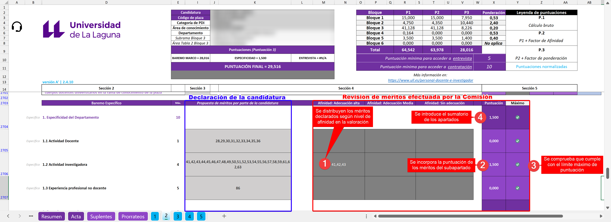

Como puede observar, se ha incorporado una columna denominada “Máximo” (Control de Puntuación Máxima). Esta columna muestra, mediante iconos, un aviso al usuario. Este aviso le indica si la puntuación introducida cumple con los límites de puntuación establecidos en el Baremo Específico correspondiente para ese apartado.

## **Paso 6.1 – Manejo de situaciones de entrevista**

Dentro de la herramienta, se consideran varias situaciones en relación con la puntuación de la entrevista pero todo atiende a la dicotomía; El acceso o no a esta fase del concurso.

En el caso de que el resultado de la suma de las puntuaciones finales (P3) del Baremo Marco y de las puntuaciones del apartado de Especificidad del Baremo Específico sea inferior a la puntuación mínima para acceder a la entrevista, se deberá declarar la exclusión de la candidatura. De lo contrario, la misma tendrá la oportunidad de acceder a esta fase siempre que así lo estime la Comisión.

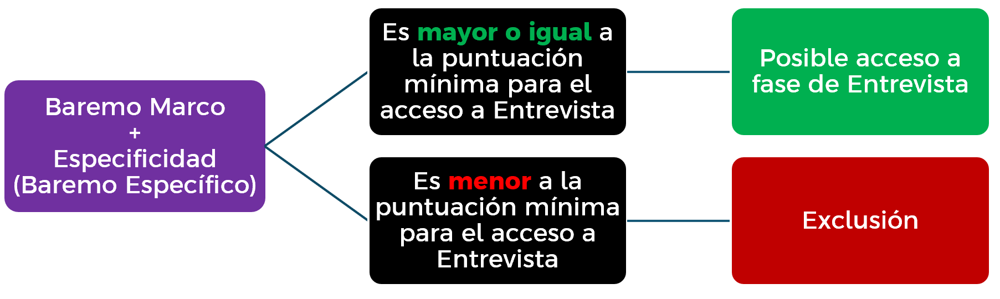

En el caso de la exclusión de la candidatura, todo este proceso será automático por lo que la Comisión no deberá hacer nada al respecto. Asimismo, esto se reflejará de la siguiente manera:

En la sección 1 de la hoja baremación pormenorizada la herramienta indicará:
    `“La candidatura no ha obtenido la puntuación mínima para acceder a entrevista”`

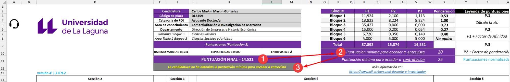

También se refleja en el resumen introduciendo el caracter “Ø” como valor en el campo de “Entrevista” e indicando “No alcanza mínimo para entrevista” en el campo “Observaciones”. Esto provocará la exclusión de la candidatura de la propuesta de provisión de la plaza.

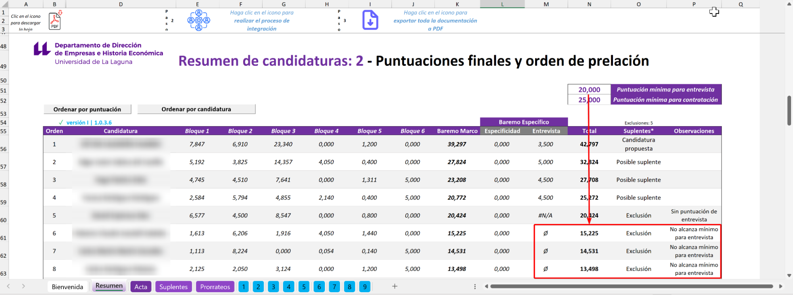

Por otro lado, si la candidatura supera la puntuación mínima para acceder a entrevista podrán darse las siguientes situaciones:

1. Si no se introduce puntuación de entrevista, se asumirá que esta no se ha realizado y en el resumen se indicará `#N/A`como resultado de la entrevista, se excluirá a la candidatura y se indicará “Sin puntuación de entrevista” en el campo “Observaciones”:

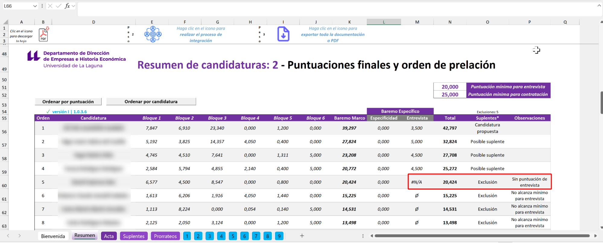!

Esto excluirá a la candidatura de la provisión de la plaza debido a que incumple la obligación de establecerse una puntuación de entrevista según el Reglamento. Esta exclusión será automática y se solventará añadiendo puntuación de entrevista en la sección correspondiente del Baremo Específico de la Baremación Pormenorizada de la candidatura.

2. En el caso de que la candidatura haya superado la puntuación mínima para acceso a entrevista pero, tras computar la puntuación de la entrevista esta sea inferior a la puntuación mínima exigida para acceder a contratación, se excluirá a la candidatura mostrando la puntuación de entrevista, indicando exclusión y “No se alcanza el mínimo para contratación” en el campo “Observaciones”:
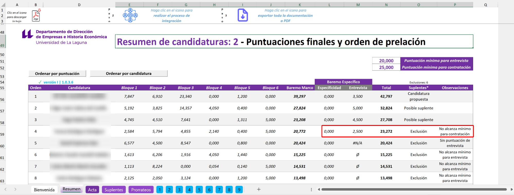

3. En el caso de que la puntuación de entrevista sí supere o iguale la puntuación mínima exigida para acceder a contratación, la candidatura podrá formar parte de la provisión de la plaza como candidatura propuesta o posible suplente:

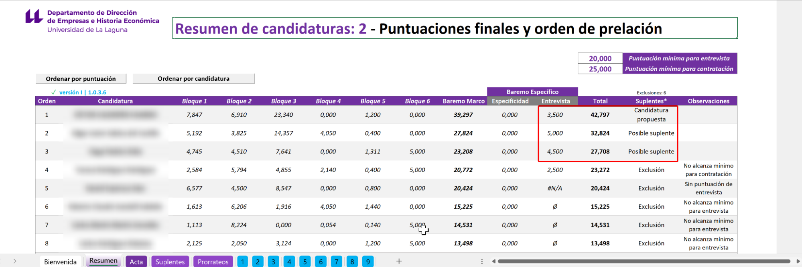

4. Por último, en ocasiones una candidatura que ha sido llamada a entrevista puede no concurrir a esta. En tal caso, y siempre que se cumpla con la normativa vigente, se deberá excluir del concurso. Para ello, deberá dirigirse a la sección 1 de la Baremación Pormenorizada de la candidatura correspondiente e indicar, del desplegable, la opción “La candidatura no concurre a entrevista”:

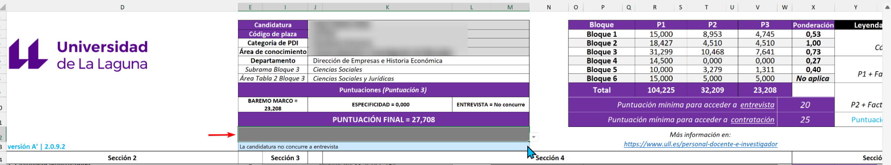

Esto mostrará el aviso en la sección 1 de la baremación pormenorizada y ajustará el resumen en los siguientes términos; “No concurre” como valor de entrevista, exclusión del concurso y “No concurre a entrevista” como valor en el campo “Observaciones”.

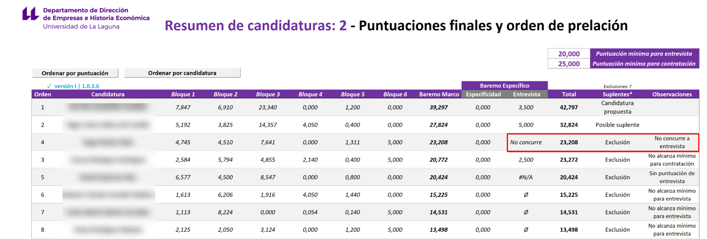

Este cálculo en el resumen será automático pero debe ser la Comisión quien introduzca en el campo de la sección 1 de la baremación pormenorizada de la candidatura a excluir, el valor visto previamente.

## Paso 7 – Observaciones

### Observaciones generales

Al final del Baremo Específico encontrará un apartado le permitirá introducir observaciones generales acerca de los méritos declarados de cara a comunicarse con la candidatura. Es posible que ésta haya hecho observaciones en su apartado correspondiente.

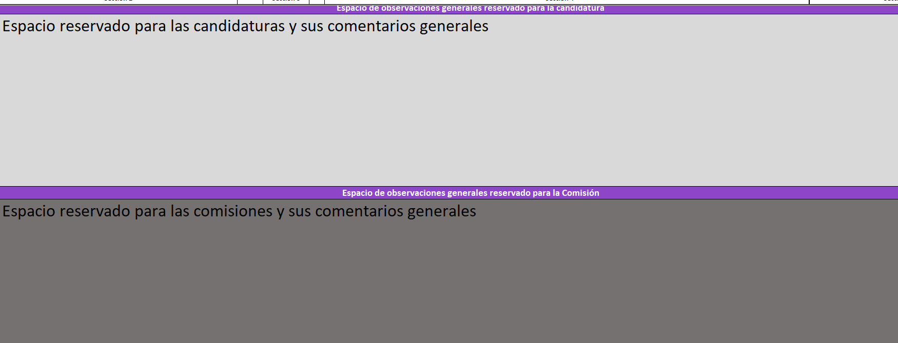

### Observaciones específicas

Por otro lado, la herramienta permite hacer uso de la función “Comentarios” de Excel para esclarecer situaciones como el motivo de no valoración de un mérito. Para hacer uso de estas deberá seguir las indicaciones del [Soporte de Microsoft](https://support.microsoft.com/es-es/office/insertar-comentarios-y-notas-en-excel-bdcc9f5d-38e2-45b4-9a92-0b2b5c7bf6f8#:~:text=fines%20de%20anotaci%C3%B3n-,Haga%20clic%20derecho%20en%20la%20celda%20y%2C%20a%20continuaci%C3%B3n%2C%20haga,clic%20fuera%20de%20la%20celda.) (ver desplegable “*Insertar comentarios encadenados para mantener conversaciones”*).

Asimismo, es posible que se encuentre con comentarios efectuados por la candidatura en su declaración de méritos. Para ello revise el desplegable del Soporte de Microsoft “*Revisar todos los comentarios de un libro*”. La recomendación es dar respuesta a estos siguiendo el hilo de la conversación puesto que este hecho ayudará a evitar posibles reclamaciones agilizando así la cobertura de la plaza.

## Paso 8 – Informe de Acta de Comisión

Tras finalizar la revisión de las baremaciones pormenorizadas de todas las candidaturas, la herramienta dispondrá de toda la información necesaria para poder elaborar el informe de Acta de Comisión.

Para ello, en la hoja **Acta** deberá cumplimentar cuatro secciones:

1. **Datos de la sesión**  
2. **Datos de asistentes**  
3. **Lista de suplentes**  
4. **Observaciones**

Como hasta ahora, utilice la leyenda de colores para identificar las celdas con las que debe interactuar. La única excepción, es la relativa al campo de “Cargo” en la sección 2, en la cual deberá seleccionar una opción del desplegable.

Respecto a la sección 3, el listado de suplentes ha sido configurado para mostrar, por defecto y de manera automática, todas las candidaturas que cumplen con los requisitos de contratación. No obstante, la Comisión tendrá la posibilidad de modificar a su elección el número de candidaturas suplentes interactuando con la celda señalada con una marca roja, contigua al texto “Listado de suplentes”. Para ello, bastará con indicar un número deseado de suplentes (en formato entero; ej: 3).

Señalar que el orden de aparición de los suplentes seguirá la siguiente lógica; **Orden descendente de puntuación sin exclusión del procedimiento por causa alguna**.

Por último, en la sección 4, la Comisión podrá hacer constar cualquier observación que considere oportuna en relación al proceso de baremación efectuado.

## Paso 9 – Exportación de información

Tras cumplimentar el Acta, todo debería estar listo para cerrar la baremación emitiendo toda la documentación requerida.

### Qué debe ser exportado

La documentación que ha de ser exportada, para publicar la propuesta de provisión de la plaza en el tablón de anuncios electrónico de la Universidad, es la siguiente:

1. **Acta**: Esta hoja contiene el Acta de la Comisión en la que figura la candidatura que mayor puntuación ha obtenido en la baremación y será, por tanto, propuesta para ocupar la plaza. Además, de manera predefinida y automática, y siempre que la Comisión lo estime oportuno y sea posible, figurará la designación de suplentes según el orden de puntuación correspondiente.

Y como anexos de esta;

1. **Resumen**: Orden de prelación de la plaza con la relación ordinal de las calificaciones obtenidas por cada candidatura en aplicación del Baremo Marco y del Baremo Específico.

2. **Baremaciones pormenorizadas**: Hojas 1-20 según candidaturas baremadas existentes en la plaza.

### Cómo realizar la exportación

La exportación de la información se ha pensado para ser efectuada mediante código con objeto de optimizar su tiempo. No obstante, para que funcione, será necesario que haya configurado correctamente el archivo (ver [Primera apertura de las herramientas de baremación](#primera-apertura-de-las-herramientas-de-baremación)).

Para efectuar la exportación deberá dirigirse a la hoja **Resumen** y hacer clic en el icono del paso 3 . Esto ejecutará una ventana de selección que le permitirá escoger una carpeta de su sistema de archivos para exportar la documentación de la plaza.

Además, encontrará este otro icono , en las hojas de "Resumen" y "Acta", que le permitirán exportar estas hojas de manera individualizada.

En caso de no poder exportar el PDF mediante la ejecución de macros, siempre podrá hacerlo de manera manual siguiendo las indicaciones de [Microsoft](https://support.microsoft.com/es-es/office/imprimir-una-hoja-de-c%C3%A1lculo-o-un-libro-f4ad7962-b1d5-4eb9-a24f-0907f36c4b94).

### **Limitaciones a la validez documental de la exportación**

No obstante lo anterior, tal y como se mencionaba en el [Paso 3 - Revisión y corrección de datos identificativos de las candidaturas](#paso-3---revisión-y-corrección-de-datos-identificativos-de-las-candidaturas), la existencia de errores en la baremación provocará la invalidez de la documentación exportada.

Estos errores serán advertidos en la tabla resumen de la hoja **Resumen** y deberán ser subsanados para que la documentación pueda ser aceptada como válida por parte del Negociado.

# **Control de calidad y soporte**

Si experimenta algún tipo de incidencia técnica relacionada con la ejecución o uso de alguna de las herramientas de baremación, por favor, póngase en contacto con el Soporte mediante el [formulario de asistencia](https://sites.google.com/ull.edu.es/baremacion-comisiones/p%C3%A1gina-principal#h.q7y6rntl1ov7).

# **Errores más frecuentes**

A continuación se muestra una tabla con los errores más frecuentes y cómo solucionarlos:

| Error | Descripción | Solución |
| :---: | :---: | :---: |
| **\!** | Visible en la tabla de ponderaciones, nos indica que no se ha seleccionado una figura de profesorado para la baremación. | Revise que en la hoja "Datos" ha cumplimentado correctamente el campo "Figura de profesorado". |
| **\#Error 1** | No se reconocen los datos de "figura de profesorado". | Revise que se ha indicado, en la configuración de la plaza, la categoría de profesorado. |
| **\#N/A Afinidad** | No hay disponibles datos de afinidad para el mérito que se pretende evaluar. | Introduzca en la sección 5.2, el nivel de afinidad a aplicar para el mérito a evaluar. |
| **\#N/A Nº Doc.** | No hay disponibles datos del número de documento de la relación de méritos de la persona candidata por lo que no se realiza el cálculo. | Introduzca en la sección 3, y en la celda correspondiente, el número de documento según la relación de méritos aportada por la candidatura. Ojo, recuerde que no debe alterarse la declaración de méritos de la candidatura. |
| **\#N/A** | La fórmula utilizada para calcular la puntuación del mérito no dispone de un valor de la sección 4 necesario para el cálculo. | Revise que en el rango de celdas de la sección 4 (Datos para el cálculo de la puntuación) se han cumplimentado todos los datos necesarios. |
| **Ø** | Este símbolo no es un error. Se utiliza en la hoja "Resumen de candidaturas" en el campo de "Entrevista" para señalar que la persona no cumple el mínimo para acceder a esta fase de la baremación según los criterios del Baremo Específico aprobados para el Departamento introducido en los "Datos de la plaza". |  |
| **\#NOMBRE\!** | Este error se produce debido a la utilización de una versión antigua de Excel que resulta en una incompatibilidad de parte del código de la herramienta. | En el caso de Windows, se ha detectado que la aparición de este error no reviste gravedad puesto que la ejecución de la herramienta de baremación en un entorno compatible subsana tal incidencia, que podría caracterizarse de índole visual. En el caso de Macintosh, se ha detectado que el normal uso de la herramienta en una versión incompatible provoca una alteración del código que incide sobre el funcionamiento esperado de los cálculos de la puntuación. Ante esta situación es precisa la intervención del \*Soporte Técnico para restaurar el código inicial\*. |
| **\#REF** | Este error indica que el valor de referencia de un cálculo no puede ser encontrado normalmente provocado por la acción de arrastrar o mover celdas o copiar/cortar información | En este caso se produce una eliminación del código original que ha de ser \*subsanado por parte del Soporte Técnico para restaurar el código inicial\*. |
