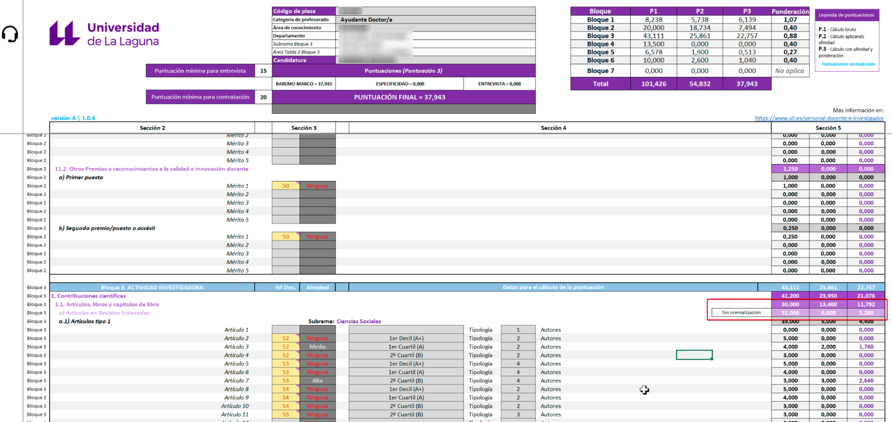
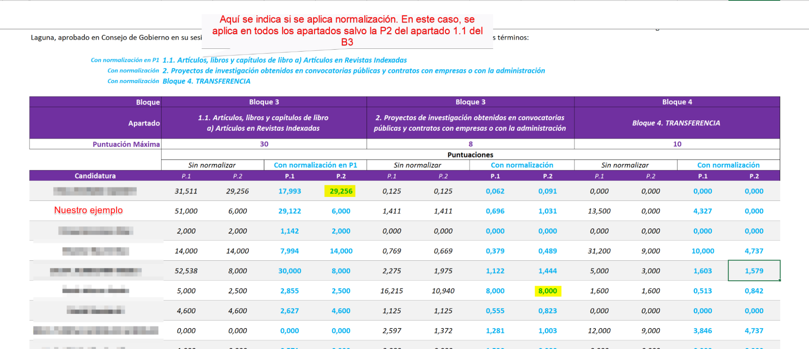
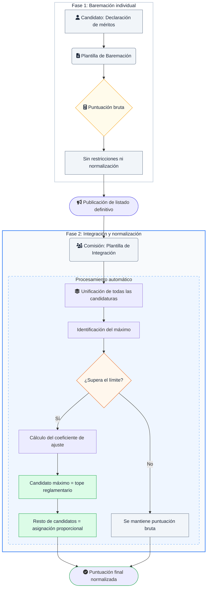

# **Baremación de plazas de PDI y Normalización**

Esta documentación detalla los criterios de cálculo, la lógica de normalización y la estructura de integración de datos en los concursos de acceso a plazas de Personal Docente e Investigador (PDI) laboral, asegurando la trazabilidad de todo el proceso.

## **1. ¿Qué es la Normalización y cómo se regula?**

La normalización es un mecanismo corrector diseñado para ponderar los méritos de forma relativa cuando las puntuaciones brutas superan los máximos establecidos en el Reglamento.

### **Marco Normativo**

Este procedimiento está regulado en el **Anexo IV del Reglamento de desarrollo de los concursos de acceso a plazas de PDI laboral de la Universidad de La Laguna** ([BOC 140/2024](https://www.gobiernodecanarias.org/boc/2024/140/2293.html)).

### **Definición del criterio**

!!! quote "Cita"
    *"Para tener en cuenta todos los méritos aportados por las candidaturas en los apartados 1.1 y 2 del bloque 3.1.º, así como en el bloque 3.2.º, se establece que, si en alguno de ellos, la candidatura con mayor puntuación superara el máximo posible, a esta persona se le asignará dicho valor máximo, y se puntuará al resto de candidaturas de forma proporcional."*

## **2. Aplicación del Procedimiento**

El proceso de baremación se divide en dos fases donde la normalización actúa de forma distinta:

### **Fase 1: Baremación Individual (Autobaremación) con la Plantilla de Baremación**

En este momento, la puntuación refleja el total de los méritos declarados **sin restricciones**. Al no existir punto de comparación con otras candidaturas, no se puede aplicar la normalización. Es una fase de "puntuación bruta".

### **Fase 2: Integración y Normalización automática con la Plantilla de Integración**

Tras la publicación del listado definitivo, la Comisión integra todas las baremaciones en la **Plantilla de Integración**. Con toda la información disponible para ser comparada, los pasos automáticos son:

1. **Identificación del máximo:** Se localiza la puntuación más alta de todas las candidaturas en cada apartado sujeto a normalización.

2. **Cálculo del coeficiente:** Si la puntuación máxima supera el límite reglamentario, esa candidatura recibe el tope (ej. 30 puntos) y se genera un coeficiente de ajuste para los demás (dividiendo el máximo permitido por la puntuación más alta real).

3. **Asignación proporcional:** El resto de candidaturas reciben una puntuación proporcional respecto a la candidatura con la puntuación más alta del apartado.

## **3. Arquitectura de datos y trazabilidad**

Para garantizar la transparencia, el cálculo sigue una **secuencia jerárquica** donde cada variable se aplica de forma independiente:

* **P1 (Cálculo Bruto):** Suma directa de méritos validados.  
* **P2 (Bruto + Afinidad):** Aplicación de coeficientes de afinidad sobre la P1.  
* **Normalización:** Ajuste de P1 y P2 según el máximo del grupo (solo en apartados indicados por el Reglamento).  
* **P3 (Resultado Final):** Sumatorio de subapartados y aplicación de factores de ponderación.

!!! info "**Aclaración**"
    En el *Resumen de Candidaturas*, el desglose de normalización muestra las **P1 y P2**. La **P3** ya contiene el valor final tras la ponderación y normalización.

## **4. Ejemplo práctico de Normalización**

Consideremos una candidatura que supera los 30 puntos establecidos para el **apartado 1.1.a) del Bloque 3º**.

### **Antes de la integración (*Plantilla de Baremación*)**

Si una candidatura obtiene **51 puntos en la P1**, el sistema individual indica que se deberá normalizar, pero no puede calcular el valor final hasta conocer el resto de las puntuaciones de los admitidos.

### **Tras la Integración (*Hoja Resumen de la Plantilla de Integración*)**

En el archivo integrado, los efectos pueden variar según la competencia:

* **Caso A (Superación de máximo):** Si otro candidato tiene **52,53 puntos**, ese candidato marcará los 30 puntos máximos. El candidato de 51 puntos recibirá la parte proporcional (29,122).  
* **Caso B (Sin superación tras afinidad):** Puede ocurrir que en la **P2** (tras aplicar afinidad) nadie supere los 30 puntos. En ese caso, la puntuación P2 no se normaliza y coincide con el valor bruto \+ afinidad.
* **Caso C (Otros Bloques):** Si en el apartado 2 alguien obtiene 10,94 puntos sobre un máximo de 8, su puntuación se rebaja automáticamente a 8, arrastrando proporcionalmente al resto.

## **5. Cuadro de Soporte**

| Soporte | Nivel de Detalle | Propósito |
| :---- | :---- | :---- |
| **Baremación Pormenorizada** | Individual y exhaustivo. | Verificación de méritos y coeficientes de afinidad aplicados por la Comisión. |
| **Resumen de Candidaturas** | Integrado y comparativo. | Análisis del impacto de la competencia (normalización) y prelación final. |

## **Resumen**

Como hemos visto, la Normalización puede modular las puntuaciones dependiendo de las puntuaciones del resto de candidatos en los apartados normalizables, por ello, es natural observar variaciones entre la baremación pormenorizada observada en la **Plantilla de Baremación** (potencial máximo) y la observada en la **Plantilla de Integración** (puntuación relativa al grupo).

## **Flujo del procedimiento**

---
